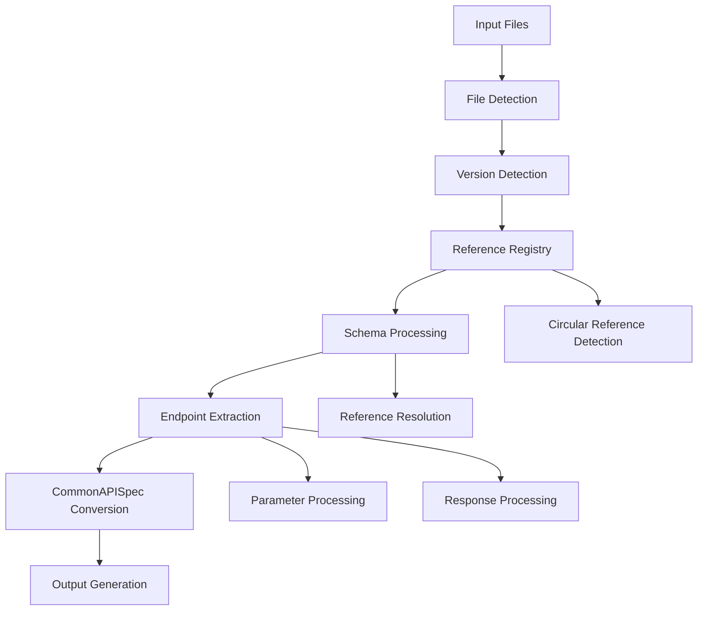

# Standalone Swagger/OpenAPI Converter

A high-performance, standalone converter for Swagger 2.0 and OpenAPI 3.x specifications to CommonAPISpec JSON format. This converter provides similar capabilities to the SOAP converter but optimized for REST API specifications.

## Features

### 🚀 **High Performance**
- **Intelligent Caching**: LRU cache with configurable size for maximum performance
- **Optimized Algorithms**: Sophisticated reference resolution and circular dependency detection
- **Memory Efficient**: Minimal memory usage with intelligent data structures
- **Parallel Processing**: Efficient batch processing capabilities

### 🔧 **Advanced Capabilities**
- **Swagger 2.0 Support**: Full support for Swagger 2.0 specifications
- **OpenAPI 3.x Support**: Complete OpenAPI 3.0 and 3.1 support
- **Reference Resolution**: Intelligent handling of `$ref` references with circular dependency detection
- **Schema Processing**: Comprehensive schema parsing and validation
- **Security Schemes**: Support for various authentication methods
- **Error Handling**: Robust error handling with detailed logging

### 📊 **Comprehensive Processing**
- **Endpoint Extraction**: Complete API endpoint information
- **Parameter Processing**: Detailed parameter analysis and validation
- **Response Handling**: Comprehensive response schema processing
- **Request Body Support**: Full request body schema processing (OpenAPI 3.x)
- **Schema Registry**: Intelligent schema management and reference resolution

## Installation

### Prerequisites
- Python 3.8+
- No external dependencies required (pure Python implementation)

### Setup
```bash
# Clone or download the converter
cd data-collector

# Make the script executable
chmod +x standalone_swagger_converter.py
```

## Usage

### Basic Usage

```bash
# Convert all Swagger/OpenAPI files in input directory
python standalone_swagger_converter.py

# Specify custom input and output directories
python standalone_swagger_converter.py --input-dir ./swagger_files --output-dir ./output

# Use short options
python standalone_swagger_converter.py -i ./input -o ./output
```

### Advanced Options

```bash
# Configure processing parameters
python standalone_swagger_converter.py \
    --input-dir ./swagger_files \
    --output-dir ./output \
    --max-depth 15 \
    --max-circular-refs 10 \
    --verbose

# Disable caching for debugging
python standalone_swagger_converter.py \
    --input-dir ./swagger_files \
    --output-dir ./output \
    --disable-caching
```

### Command Line Options

| Option | Short | Description | Default |
|--------|-------|-------------|---------|
| `--input-dir` | `-i` | Directory containing Swagger/OpenAPI files | `./input` |
| `--output-dir` | `-o` | Directory to output CommonAPISpec JSON files | `./output` |
| `--max-depth` | | Maximum reference resolution depth | `10` |
| `--max-circular-refs` | | Maximum circular references allowed | `5` |
| `--disable-caching` | | Disable intelligent caching | `false` |
| `--verbose` | `-v` | Enable verbose logging | `false` |

## Supported File Formats

### Input Formats
- **JSON**: `.json` files containing Swagger 2.0 or OpenAPI 3.x specifications
- **YAML**: `.yaml` and `.yml` files (requires PyYAML for full support)

### Output Format
- **CommonAPISpec JSON**: Standardized JSON format for API specifications

## Architecture

### Core Components

#### 1. **IntelligentCache**
- LRU (Least Recently Used) cache implementation
- Configurable cache size
- Hit rate tracking and statistics
- Memory-efficient eviction policies

#### 2. **CircularReferenceDetector**
- Graph-based circular dependency detection
- DFS (Depth-First Search) algorithm
- Path tracking for circular reference identification
- Thread-safe operations

#### 3. **OptimizedReferenceResolver**
- High-performance reference resolution
- Intelligent caching of resolved references
- Circular reference prevention
- Support for complex reference chains

#### 4. **HighPerformanceSwaggerParser**
- Version detection (Swagger 2.0 vs OpenAPI 3.x)
- Optimized schema processing
- Comprehensive endpoint extraction
- Advanced parameter and response handling

### Processing Flow



## CommonAPISpec Output Format

The converter generates standardized CommonAPISpec JSON files with the following structure:

```json
{
  "metadata": {
    "spec_type": "OpenAPI 3.x",
    "version": "3.0.0",
    "title": "API Title",
    "description": "API Description",
    "version_info": "1.0.0",
    "contact": { ... },
    "license": { ... },
    "file_path": "/path/to/spec.json",
    "processed_at": "2024-01-01T00:00:00",
    "processing_stats": { ... }
  },
  "endpoints": [
    {
      "path": "/users",
      "method": "GET",
      "operation_id": "getUsers",
      "summary": "Get all users",
      "description": "Retrieve a list of users",
      "tags": ["users"],
      "parameters": [ ... ],
      "responses": { ... },
      "security": [ ... ],
      "deprecated": false
    }
  ],
  "schemas": {
    "User": {
      "type": "object",
      "properties": { ... },
      "required": [ ... ]
    }
  },
  "security": {
    "schemes": { ... }
  },
  "servers": [ ... ]
}
```

## Performance Optimization

### Caching Strategy
- **Reference Caching**: Resolved references are cached to avoid repeated processing
- **Schema Caching**: Processed schemas are cached for reuse
- **LRU Eviction**: Least recently used items are evicted when cache is full
- **Hit Rate Tracking**: Monitor cache performance for optimization

### Memory Management
- **Weak References**: Use weak references where appropriate to prevent memory leaks
- **Efficient Data Structures**: Optimized data structures for minimal memory usage
- **Batch Processing**: Process multiple files efficiently without loading all into memory

### Algorithm Optimization
- **Graph Algorithms**: Efficient circular dependency detection using DFS
- **Path Navigation**: Optimized JSON path navigation for reference resolution
- **Parallel Processing**: Concurrent processing where possible

## Error Handling

### Error Types
- **File Parsing Errors**: Invalid JSON/YAML files
- **Specification Errors**: Malformed Swagger/OpenAPI specifications
- **Reference Errors**: Unresolvable or circular references
- **Processing Errors**: General processing failures

### Error Recovery
- **Graceful Degradation**: Continue processing other files when one fails
- **Detailed Logging**: Comprehensive error logging with stack traces
- **Error Statistics**: Track error rates and types for analysis

### Logging
- **Structured Logging**: Consistent log format with timestamps
- **Multiple Levels**: DEBUG, INFO, WARNING, ERROR levels
- **File Output**: Logs written to `standalone_swagger_converter.log`
- **Console Output**: Real-time progress and error reporting

## Testing

### Test Suite
Run the comprehensive test suite:

```bash
python test_swagger_converter.py
```

### Test Coverage
- **Swagger 2.0 Processing**: Complete Swagger 2.0 specification handling
- **OpenAPI 3.x Processing**: Full OpenAPI 3.0 and 3.1 support
- **Reference Resolution**: Complex reference chains and circular dependencies
- **Error Handling**: Invalid files and malformed specifications
- **Performance**: Cache hit rates and processing statistics

### Sample Files
The test suite includes:
- **Swagger 2.0**: Complete user management API
- **OpenAPI 3.x**: Product catalog API with complex schemas
- **Error Cases**: Invalid JSON and non-Swagger files

## Comparison with SOAP Converter

| Feature | SOAP Converter | Swagger Converter |
|---------|----------------|-------------------|
| **Input Format** | WSDL/XSD | Swagger 2.0/OpenAPI 3.x |
| **Reference Resolution** | XML Namespaces | JSON References |
| **Schema Processing** | XSD Complex Types | JSON Schema |
| **Caching** | Intelligent Cache | Intelligent Cache |
| **Circular Detection** | Graph Algorithms | Graph Algorithms |
| **Performance** | High Performance | High Performance |
| **Error Handling** | Comprehensive | Comprehensive |

## Best Practices

### File Organization
```
input/
├── swagger2/
│   ├── api-v1.json
│   └── api-v2.json
├── openapi3/
│   ├── products-api.json
│   └── users-api.json
└── mixed/
    ├── legacy-api.json
    └── modern-api.json
```

### Processing Strategy
1. **Group by Version**: Separate Swagger 2.0 and OpenAPI 3.x files
2. **Batch Processing**: Process similar files together
3. **Error Monitoring**: Monitor error rates and adjust parameters
4. **Cache Optimization**: Tune cache size based on file complexity

### Performance Tuning
- **Cache Size**: Increase cache size for complex specifications
- **Max Depth**: Adjust reference resolution depth based on complexity
- **Circular Refs**: Set appropriate limits for circular reference detection
- **Memory Usage**: Monitor memory usage for large batch processing

## Troubleshooting

### Common Issues

#### 1. **Circular Reference Errors**
```
Error: Circular reference detected: #/components/schemas/User
```
**Solution**: Increase `--max-circular-refs` or fix the specification

#### 2. **Reference Resolution Failures**
```
Error: Reference path not found: #/definitions/NonExistentSchema
```
**Solution**: Check specification for typos in reference paths

#### 3. **Memory Issues**
```
Error: Out of memory during processing
```
**Solution**: Reduce cache size or process files in smaller batches

#### 4. **Invalid JSON**
```
Error: Invalid JSON in file: spec.json
```
**Solution**: Validate JSON syntax before processing

### Debug Mode
Enable verbose logging for detailed debugging:

```bash
python standalone_swagger_converter.py --verbose
```

### Performance Monitoring
Monitor cache hit rates and processing statistics:

```bash
# Check log file for statistics
tail -f standalone_swagger_converter.log | grep "Cache hit rate"
```

## Contributing

### Development Setup
1. Fork the repository
2. Create a feature branch
3. Make your changes
4. Add tests for new functionality
5. Run the test suite
6. Submit a pull request

### Code Style
- Follow PEP 8 guidelines
- Use type hints for all functions
- Add comprehensive docstrings
- Include error handling for all operations

### Testing
- Add tests for new features
- Ensure backward compatibility
- Test with various specification formats
- Verify performance characteristics

## License

This project is licensed under the MIT License - see the LICENSE file for details.

## Support

For issues, questions, or contributions:
- Create an issue in the repository
- Check the troubleshooting section
- Review the test suite for examples
- Consult the logging output for detailed error information

---

**Note**: This converter is designed to be a standalone tool similar to the SOAP converter but optimized for Swagger/OpenAPI specifications. It provides the same level of performance and reliability while handling the unique challenges of REST API specifications.
